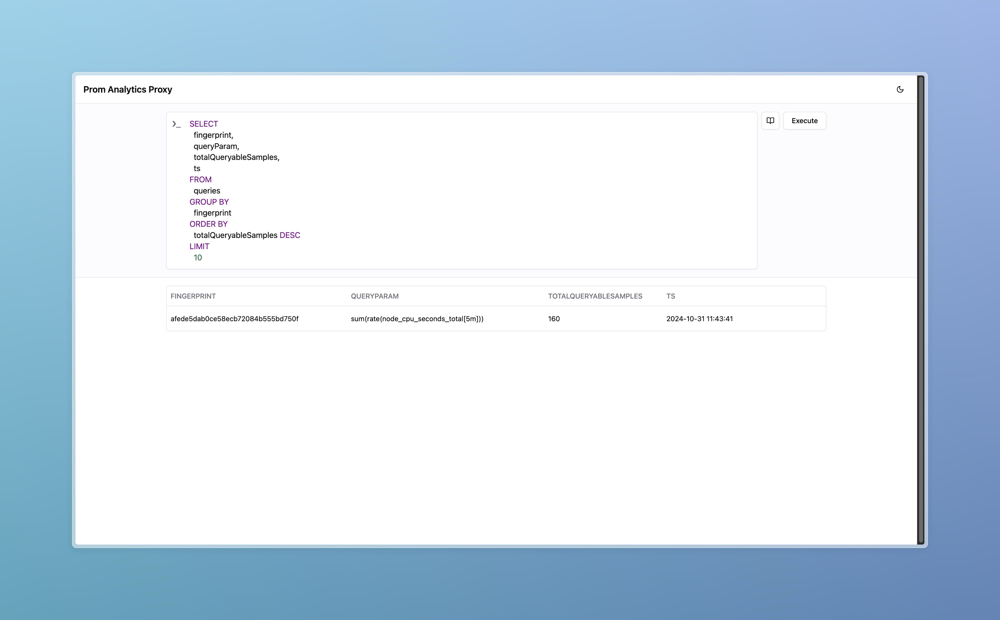

# prom-analytics-proxy

[](https://github.com/nicolastakashi/prom-analytics-proxy/actions/workflows/ci.yaml)

## Table of Contents

- [Overview](#overview)
- [Features](#features)
- [Project Structure](#project-structure)

## Overview

`prom-analytics-proxy` is a lightweight proxy application designed to sit between your Prometheus server and its clients. It provides valuable insights by collecting detailed analytics on PromQL queries, helping you understand query performance, resource usage, and overall system behavior. This can significantly improve observability for Prometheus users, providing actionable data to optimize query execution and infrastructure.



## Features

- **Query Analytics**: Collects detailed statistics on PromQL queries, including query execution times, resource consumption, and the number of series touched.
- **Data Storage**: Supports storing the collected analytics data in either ClickHouse or PostgreSQL, giving flexibility based on your database preferences.
- **User Interface**: Provides an intuitive web-based UI to explore and visualize the analytics data, helping engineers make data-driven decisions on query optimizations.
- **Easy Integration**: Seamlessly integrates with existing Prometheus setups with minimal configuration.

## Project Structure

The project is organized into the following core components:

- **`prom-analytics-proxy`**: A Go-based backend application responsible for acting as a proxy between Prometheus and clients. It captures and processes analytics from PromQL queries, offering insights into query performance metrics such as execution time, resource usage, and efficiency.

- **`prom-analytics-proxy-ui`**: A React-based user interface located in the `ui` directory. This component provides a visual platform to explore the analytics data collected by the proxy, making it easier to analyze and identify trends in PromQL queries.

Both components are designed to work together, with `prom-analytics-proxy` handling data collection and backend logic, while `prom-analytics-proxy-ui` provides a frontend interface for exploring query insights.

## Flags

```bash mdox-exec="go run main.go --help" mdox-expect-exit-code=0
  -clickhouse-addr string
    	Address of the clickhouse server, comma separated for multiple servers. (default "localhost:9000")
  -clickhouse-database string
    	Database for the clickhouse server, can also be set via CLICKHOUSE_DATABASE env var. (default "default")
  -clickhouse-dial-timeout duration
    	Timeout to dial clickhouse. (default 5s)
  -clickhouse-password string
    	Password for the clickhouse server, can also be set via CLICKHOUSE_PASSWORD env var.
  -clickhouse-username string
    	Username for the clickhouse server, can also be set via CLICKHOUSE_USER env var.
  -database-provider string
    	The provider of database to use for storing query data. Supported values: clickhouse, postgresql
  -include-query-stats
    	Request query stats from the upstream prometheus API.
  -insecure-listen-address string
    	The address the prom-analytics-proxy proxy HTTP server should listen on. (default ":9091")
  -insert-batch-size int
    	Batch size for inserting queries into the database. (default 10)
  -insert-buffer-size int
    	Buffer size for the insert channel. (default 100)
  -insert-flush-interval duration
    	Flush interval for inserting queries into the database. (default 5s)
  -insert-grace-period duration
    	Grace period to insert pending queries after program shutdown. (default 5s)
  -insert-timeout duration
    	Timeout to insert a query into the database. (default 1s)
  -log-format string
    	Log format (text, json) (default "text")
  -log-level string
    	Log level (default "INFO")
  -postgresql-addr string
    	Address of the postgresql server. (default "localhost")
  -postgresql-database string
    	Database for the postgresql server, can also be set via POSTGRESQL_DATABASE env var.
  -postgresql-dial-timeout duration
    	Timeout to dial postgresql. (default 5s)
  -postgresql-password string
    	Password for the postgresql server, can also be set via POSTGRESQL_PASSWORD env var.
  -postgresql-port int
    	Port of the postgresql server. (default 5432)
  -postgresql-sslmode string
    	SSL mode for the postgresql server. (default "disable")
  -postgresql-user string
    	Username for the postgresql server, can also be set via POSTGRESQL_USER env var.
  -upstream string
    	The URL of the upstream prometheus API.
```
